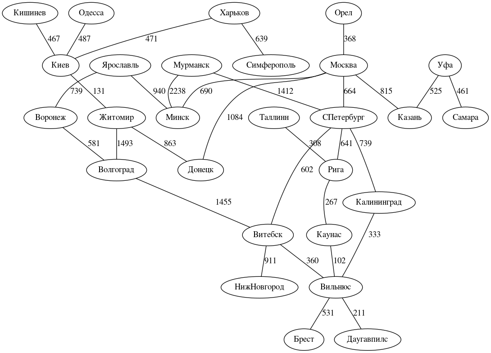
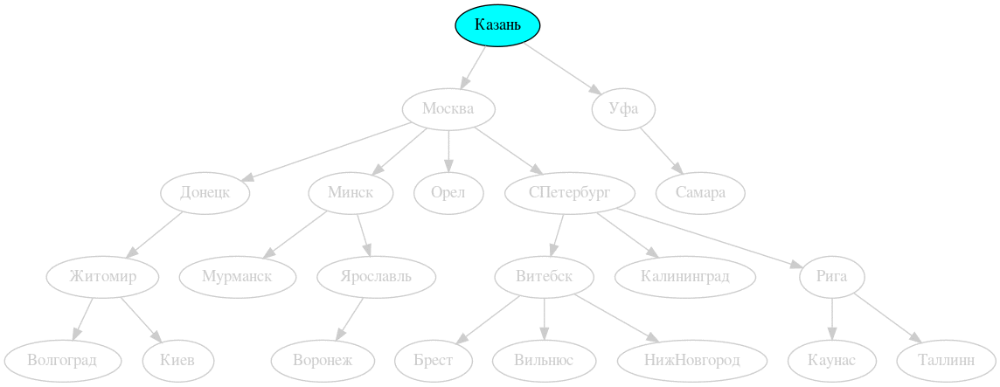
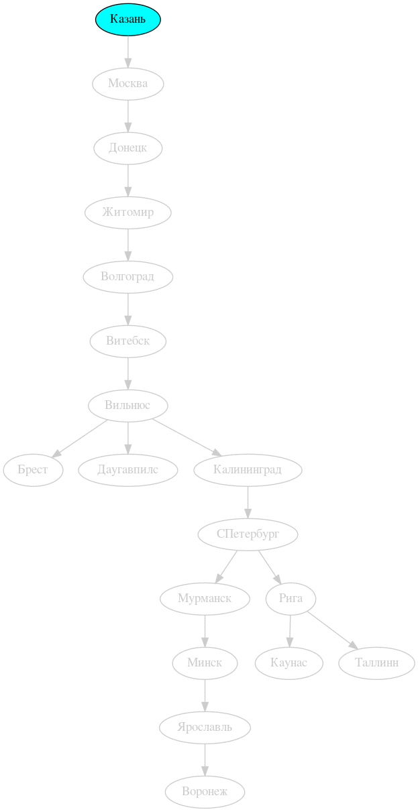
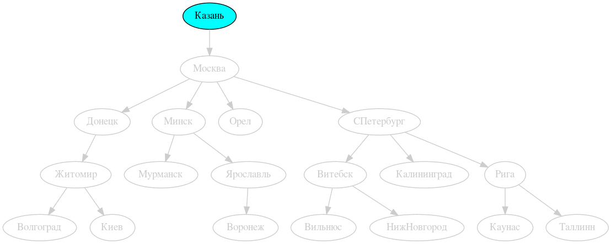
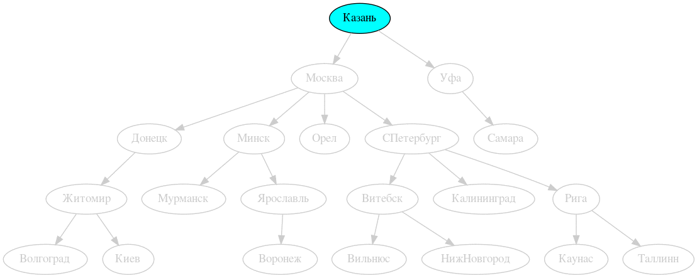
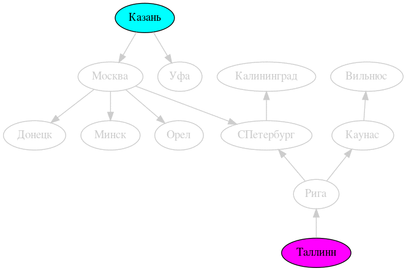
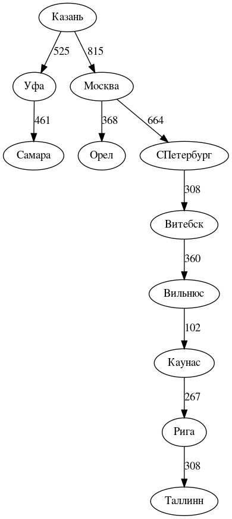
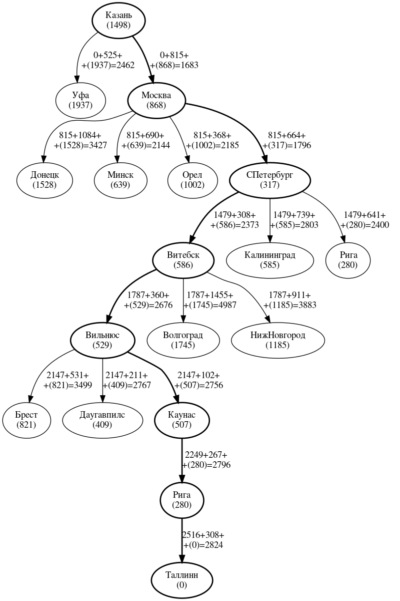

# Global cities map

# Blind (uninformed) search algorithms

## Width-first search

## Depth-first search

## Depth-limited search

## Iterative-deepening depth-first search

## Bidirectional width-first search

# Heuristic (informed) search algorithms

## Hungry best-first search

## A* search

